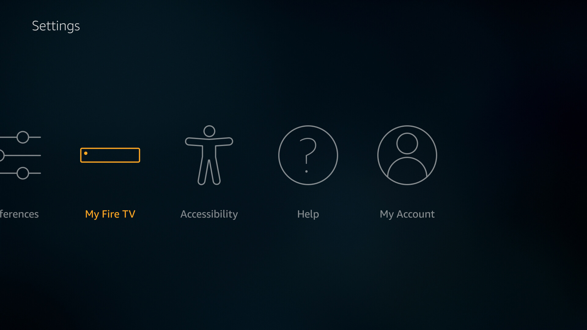
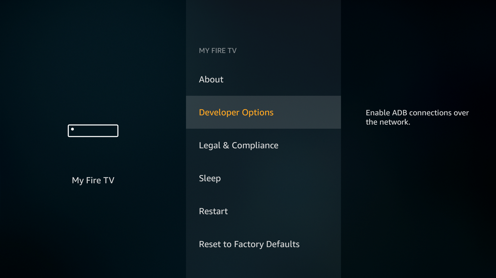
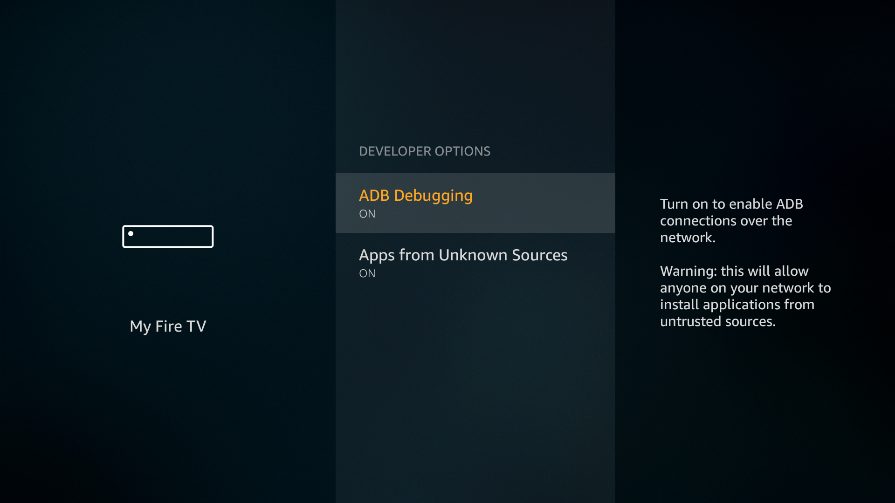

# Connect your Amazon FireTV on SyntropyStack with Wireguard

## Enable ADB on FireTV.

First step to side load the app to FireTv is to enable ADB debugging and Apps from unknown sources.

To do this Goto Settings -> My FireTV -> Developer Options

- Choose Option My FireTV from Settings

- Choose Developer Options

- Turn on ADB debugging and Apps from unknown sources

## Download Wireguard APK

From APKPure
https://m.apkpure.com/wireguard/com.wireguard.android

From F-Droid
https://f-droid.org/en/packages/com.wireguard.android/

From APK4fun
https://www.apk4fun.com/apps/com.wireguard.android/

Next we can download the wireguard apk to your system. Once the download is finished let’s connect the system to our FireTV.

## Find IP address

Go to FireTV > About > Network

## Download ADBLink

Download adbLink for your platform from http://jocala.com/

The next step is to configure the adbLink device. Open / Run the adbLink file. If you are using it for the first time, you will not see anything in the "Current Device" list. Click "new" to create a new Fire TV device profile, as shown below:

Next, enter the network IP address of the Fire TV you're connecting to.

Done. once the installtion is success you can see wireguard among the other app on fireTV. Open the wireguard app on fireTV to configure the VPN.
