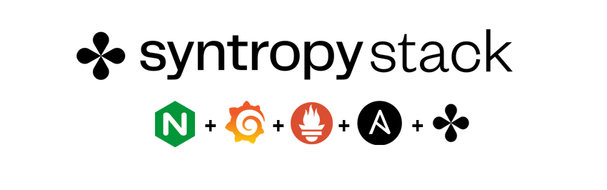

<center></center>

# Monitoring solution with Grafana, Prometheus, node_exporter and Nginx - Ansible and SyntropyCTL


# Description / Requirements :

- **Syntropy Stack** account and an active Agent Token
- There must be **no ports exposed to the internet** (except Nginx 443 with SSL). Set up your firewall accordingly.
- The **subnets for the docker networks** for each of the nodes must be unique
- **Wireguard** must be installed and running on each server
- **Ansible** needs to be installed on your Control node - Localhost
- Python >= 3.6
- **Generate an SSH key** then copy it to all the servers (Ansible connection)
- **Generate an SSH key** then copy it to your GitHub account (to download it from dependencies)

# Documentation SyntropyStack

- https://docs.syntropystack.com/docs

# Build 3x VM from 3x different providers (preferably)

- VM1:  **Nginx + Grafana**
- VM2:  **Prometheus**
- VM3:  **Node-Exporter**

<<<<<<< Updated upstream
# Installation

Copy the entire **roles directory** to your controller server

Install the Syntropy Ansible Galaxy Collection.

```
ansible-galaxy collection install git@github.com:SyntropyNet/syntropy-ansible-collection.git
```

Navigate to your local ansible directory:

```
cd /root/.ansible/collections/ansible_collections/syntropynet/syntropy
```

Install the Python dependencies.

```
pip3 install -U -r requirements.txt
```
=======
# Installation SyntropyCTL

You can install our packages in the following ways:

You can install the sdk using pip:
`pip3 install syntropycli`

Latest development version:
- HTTPS
`pip3 install git+https://github.com/SyntropyNet/syntropy-cli#egg=syntropycli`

- Git
`pip install git+git@github.com:SyntropyNet/syntropy-cli#egg=syntropycli`

- requirements.txt
`-e git+git@github.com:SyntropyNet/syntropy-cli#egg=syntropycli`

>>>>>>> Stashed changes

# Authentication

Generate an API Token by logging in using the CLI:

```
syntropyctl login {syntropy stack user name} { syntropy stack password}
```

In the file `secrets.yaml`:
- add your `agent_token`   -> generated via SyntropyUI - [SyntropyUI](https://docs.syntropystack.com/docs/get-your-agent-token)
- add your `api_token` -> generated via SyntropyCTL  - [SyntropyCLI](https://github.com/SyntropyNet/syntropy-cli)


# Create the file "prometheus.yml" on VM2 - Prometheus

```
      global:
        scrape_interval: 5s
        external_labels:
          monitor: 'node'
      scrape_configs:
        - job_name: 'prometheus'
          static_configs:
            - targets: ['DOCKER_IP_PROMETHEUS:9090']
        - job_name: 'node-exporter'
          static_configs:
            - targets: ['DOCKER_IP_EXPORTER:9100']
```


# Provision your Virtual Machines

- **Generate an SSH key** then copy it to all the servers (Ansible connection)

Edit `/etc/ansible/hosts`

Info:
- For Python >= 2.7 [servers:vars] ansible_python_interpreter=/usr/bin/python3
- For Python <= 2.7 [servers:vars] ansible_python_interpreter=/usr/bin/python

```
[nginx]
yourfirstpubip ansible_python_interpreter=/usr/bin/python3

[prometheus]
yoursecondpubip ansible_python_interpreter=/usr/bin/python3

[node-exporter]
localhost ansible_python_interpreter=/usr/bin/python3
```

Test Connection: `ansible -m ping all`

Output result:
```
localhost | SUCCESS => {
    "changed": false,
    "ping": "pong"
}
*.*.*.* | SUCCESS => {
    "changed": false,
    "ping": "pong"
}
*.*.*.* | SUCCESS => {
    "changed": false,
    "ping": "pong"
}
```

# Configure your playbooks

In this file: `deploy_agent_and_service.yaml`, change:
- `agent_provider` in each of the service's playbook to match each server's cloud provider, a reference to the providers can be found [here](https://docs.syntropystack.com/docs/syntropy-agent-variables).
- `domain_dns` <-- For your SSL connection
- `Email`
- `login_grafana` <-- Access to Grafana UI
- `pass_grafana`


# Deploy Agent / Services

Deploy the Syntropy Agent + Services:
```
ansible-playbook deploy_agent_and_service.yaml
```


# Deploy the Network - with SyntropyCLI - there are many ways:


* Solution 1 -using SyntropyCTL command

Create a network for your account:
`syntropyctl create-network --help`

```
Usage: syntropyctl create-network [OPTIONS] NAME

  Possible network topologies are P2P, P2M, MESH. The network topology is
  mainly used for Network as Code usage scenarious.

  P2P - used to configure the network using endpoint pairs.
  P2M - used to configure the network when one endpoint connects to many endpoints.
  MESH - used to configure the network where every endpoint is connected to every other endpoint.

Options:
  --topology TEXT  Specifies Network Topology that is used by configure-
                   networks or Ansible playbooks.

  --help           Show this message and exit.
```

<<<<<<< Updated upstream
`syntropyctl create-network MQT3 --topology P2M` <- used to configure the network when one endpoint connects to many endpoints.
=======
`syntropyctl create-network MON3 --topology P2M` <- used to configure the network when one endpoint connects to many endpoints.
>>>>>>> Stashed changes


List the Syntropy Networks on your account:
`syntropyctl get-networks --help`

```
Usage: syntropyctl get-networks [OPTIONS]

  List all networks.

  By default this command will retrieve up to 42 networks. You can use
  --take parameter to get more networks.

Options:
  --network TEXT     Filter networks by name/ID.
  -s, --show-secret  Shows Network secrets.
  --skip INTEGER     Skip N networks.
  --take INTEGER     Take N networks.
  -j, --json         Outputs a JSON instead of a table.
  --help             Show this message and exit.
```
<<<<<<< Updated upstream

=======
Launch this:
>>>>>>> Stashed changes
`syntropyctl get-endpoints`

Result:
```
+----------+------+----------------+-----------------+-------------------+--------+---------------+
| Agent ID | Name |   Public IP    |     Provider    |      Location     | Online |      Tags     |
+----------+------+----------------+-----------------+-------------------+--------+---------------+
|   640    | VM1  |  ************  |       OVH       |                   |  True  |     Nginx     |
|   642    | VM3  |  ************  | Microsoft Azure |                   |  True  | Node-Exporter |
|   641    | VM2  |  ************  |   Oracle Cloud  | Frankfurt am Main |  True  |   Prometheus  |
+----------+------+----------------+-----------------+-------------------+--------+---------------+
```

<<<<<<< Updated upstream

* Solution 2  - using SyntropyNAC command and YAML template


=======
Enable each of the services (match the IDs to your own):

Example:
```
syntropyctl configure-endpoints --enable-all-services <Agent_ID>
```

Launch this:
```
syntropyctl configure-endpoints --enable-all-services 640
```

```
syntropyctl configure-endpoints --enable-all-services 641
```

```
syntropyctl configure-endpoints --enable-all-services 642
```


Next, create the connections using the `create-connections` command.

Example:
```
syntropyctl create-connections -j <network_name> <broker_id> <publisher_id> <broker_id> <subscriber_id>
```

Launch this:
```
syntropyctl create-connections -j MON3 640 641 641 642
```

Your output should resemble this:
```
[
    {
        "agent_connection_id": 26278,
        "agent_1_id": 640,
        "agent_interface_1_id": 2675,
        "agent_2_id": 641,
        "agent_interface_2_id": 2676,
        "network_id": 318,
        "agent_connection_created_at": "2021-01-16T13:19:51.870",
        "agent_connection_updated_at": "2021-01-16T13:19:51.870",
        "agent_connection_modified_at": "2021-01-16T13:19:51.870",
        "agent_sdn_policy_id": null,
        "agent_connection_link_tag": "PUBLIC",
        "agent_connection_status": "PENDING",
        "agent_connection_status_reason": null,
        "agent_connection_last_handshake": null,
        "agent_connection_tx_bytes_total": null,
        "agent_connection_rx_bytes_total": null,
        "agent_connection_latency_ms": null,
        "agent_connection_packet_loss": null
    },
    {
        "agent_connection_id": 26279,
        "agent_1_id": 641,
        "agent_interface_1_id": 2676,
        "agent_2_id": 642,
        "agent_interface_2_id": 2677,
        "network_id": 318,
        "agent_connection_created_at": "2021-01-16T13:19:51.870",
        "agent_connection_updated_at": "2021-01-16T13:19:51.870",
        "agent_connection_modified_at": "2021-01-16T13:19:51.870",
        "agent_sdn_policy_id": null,
        "agent_connection_link_tag": "PUBLIC",
        "agent_connection_status": "PENDING",
        "agent_connection_status_reason": null,
        "agent_connection_last_handshake": null,
        "agent_connection_tx_bytes_total": null,
        "agent_connection_rx_bytes_total": null,
        "agent_connection_latency_ms": null,
        "agent_connection_packet_loss": null
    }
]
```


* Solution 2  - using SyntropyNAC command and YAML template

The template is defined in `network/MON3.yaml`. You can first perform a dry run using the `--dry-run` flag.

```
syntropynac configure-networks --dry-run networks/MON4.yaml
```

Result:
```
Configuring network MON3
Would create network MON3 as P2M
Would create 2 connections for network MON4
Done
```

Next, create the network:
```
syntropynac configure-networks network/MON3.yaml
```

The result looks like:
```
Configuring network MON3
Created network MON3 with id 319
Created 2 connections for network MON3
Configured 2 connections and 2 subnets for network MON4
Done
```
>>>>>>> Stashed changes


# Node_Exporter <-> Prometheus

Change value on file `prometheus.yml`:
```
- targets: ['DOCKER_IP_PROMETHEUS:9090']
- targets: ['DOCKER_IP_EXPORTER:9100']
```


# Configuration Grafana

- Connect to https://DomainDNS address + Add DataSource Prometheus and identify DOCKER_IP_PROMETHEUS

- Import (Create > Import) this Dashboard: https://grafana.com/grafana/dashboards/11074

<center></center>


**Congratulations, your architecture is up and running ;-)**
